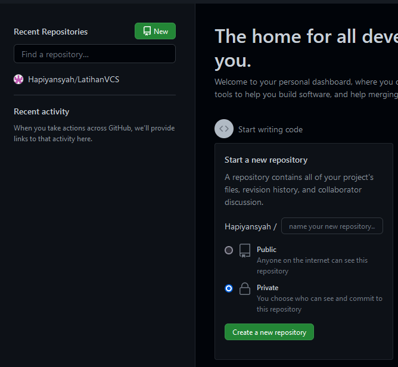
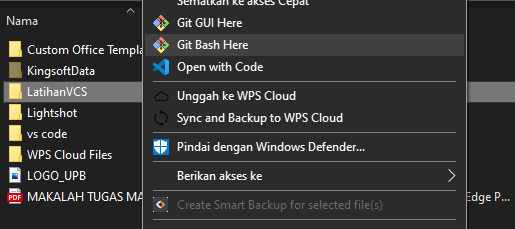
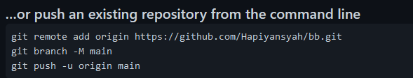
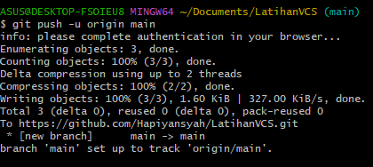

### 1. Login Git
Untuk login ke Git, Anda bisa menggunakan akun GitHub, Gitlab, atau Bitbucket. Jika belum memiliki akun dari ketiga platform tersebut, Anda bisa mendaftarkan diri terlebih dahulu. Selanjutnya Anda bisa melakukan login awal pada Git  menggunakan Command Prompt  (Windows) atau Command Line (Linux) . Kemudian masukkan perintah-perintah yang akan kami jelaskan di bawah ini.
Selanjutnya, masukkan username GitHub Anda menggunakan perintah di bawah ini. Lalu tekan ENTER jika sudah benar.
```
$ git config --global user.name "UsernameAnda"
```
Kemudian masukkan email yang terdaftar di GitHub Anda menggunakan perintah di bawah  ini. Lalu tekan ENTER jika sudah benar.
```
$ git config --global user.email IsiDenganEmailAnda@gmail.com
```
Selanjutnya untuk memastikan proses login Anda berhasil, masukkan perintah berikut.
```
$ git config --list
```
### 2. Login Github
Langkah kedua dalam belajar menggunakan Git adalah Anda harus login ke dalam website GitHub. Github dan Git memiliki hubungan khusus, yaitu Git yang berperan sebagai version control system dan Github menjadi hosting atau sebagai penyimpan kode pemrograman.
Setelah Anda login, akan muncul tampilan dashboard dari GitHub.
### 3. Buat Repository
Setelah berhasil login ke GitHub, Anda bisa mulai membuat repository. Klik tombol New pada menu Repositories untuk membuat repository baru.
Kemudian Anda akan diarahkan pada halaman untuk membuat repository baru seperti gambar di bawah ini.
Anda perlu mengisi detail informasi berikut:
1) Nama Repository : digunakan untuk identitas repository yang dibuat.
2) Deskripsi Repository : berfungsi untuk deskripsi dari repository yang dibuat.
3) Jenis Repository   : jenis repository  dibagi menjadi Public dan Private. Ketika Anda mengatur repository menjadi Public, orang lain dapat melihat repository yang Anda buat. Sebaliknya, jika Anda mengaturnya sebagai Private, repository tersebut hanya bisa diakses oleh Anda.
Setelah mengisi detail informasi di atas, klik Create Repository.

### 4. Buat Folder pada Windows
Selanjutnya, Anda perlu membuat folder pada local disk komputer Anda. Fungsinya adalah untuk menyimpan update file dari repository GitHub yang telah Anda buat.
### 5. Buka Folder Menggunakan Git Bash
Setelah berhasil membuat folder pada local disk komputer Anda,  buka folder tersebut dengan cara klik kanan lalu pilih Git Bash Here. Setelah itu, Command Prompt akan muncul seperti di bawah ini. 


### 6. Ubah Folder Menjadi Repository
Setelah itu, ubah folder tersebut menjadi repository menggunakan perintah berikut:
```
$ git init
```
### 7. Tambahkan File ke Repository
Untuk bisa menambahkan file ke repository GitHub, Anda perlu menerapkan langkah-langkah di bawah ini:
1) Buat file di folder yang sudah dibuat (Test Git). Contohnya, di sini kami membuat file index.php
2) Buka GitBash lalu masukkan perintah berikut:
```
$ git add index.php
```
Perintah tersebut tidak akan menghasilkan output apa pun.
### 8. Buat Commit 
Selanjutnya, Anda perlu membuat Commit. Commit berfungsi untuk menambahkan update file serta komentar. Jadi setiap kontributor bisa memberikan konfirmasi update file di proyek yang sedang dikerjakan. Masukkan perintah berikut untuk membuat Commit:
```
$ git commit -m "first commit"
```
Pada tutorial ini saya membuat  first commit sebagai Commit pertama kami. Anda bebas membuat membuat nama Commit apa saja.
### 9. Ikuti Langkah Pada GitHub
```
git remote add origin https://github.com/Hapiyansyah/LatihanVCS.git
git branch -M main
git push -u origin main
```


### 10. selesai
